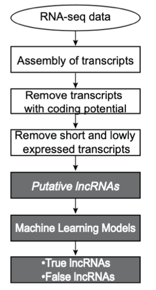

# Flnc

## Introduction

Flnc is software that can accurately identify full-length long noncoding RNAs (lncRNAs) from human RNA-seq data. lncRNAs are linear transcripts of more than 200 nucleotides that do not encode proteins. The most common approach for identifying lncRNAs from RNA-seq data which examines the coding abilities of assembled transcripts will result in a very high false-positive rate (30%-75%) of lncRNA identification. The falsely discovered lncRNAs lack transcriptional start sites and most of them are RNA fragments or result from transcriptional noise. Unlike the false-positive lncRNAs, true lncRNAs are full-length lncRNA transcripts that include transcriptional start sites (TSSs). To exclude these false lncRNAs, H3K4me3 chromatin immunoprecipitation sequencing (ChIP-seq) data had been used to examine transcriptional start sites of putative lncRNAs, which are transcripts without coding abilities. However, because of cost, time, and the limited availability of sample materials for generating H3K4me3 ChIP-seq data, most samples (especially clinical biospecimens) may have available RNA-seq data but lack matched H3K4me3 ChIP-seq data. This Flnc method solves the problem of lacking transcriptional initiation profiles when identifying lncRNAs. 

Flnc integrates seven machine-learning algorithms built with four genomic features. Flnc achieves state-of-the-art prediction power with a AUROC score over 0.92. Flnc significantly improves the prediction accuracy from less than 50% using the common approach to over 85% on five independent datasets without requiring matched H3K4me3 ChIP-seq data. In addition to the stranded polyA-selected RNA-seq data, Flnc can also be applied to identify lncRNAs from stranded RNA-seq data of ribosomal RNA depleted samples or unstranded RNA-seq data of polyA-selected samples. 



**Please cite our paper at *Non-Coding RNA* journal (https://doi.org/10.3390/ncrna8050070), if you find Flnc useful for your research. 

Version: 1.0.0

Last Modified: 07/27/2022

Authors: Zixiu Li (zixiu.li@umassmed.edu), Chan Zhou (chan.zhou@umassmed.edu)

Maintainer: Zixiu Li


## Prerequisites

To use Flnc, you will need the following programs in your PATH:

•       singularity (>=3.7.1)

•       python2 (>=2.7) 

•       gcc (>=4.8.5)

•       OS: high performance computing cluster in Linux (suggested)

•       Reference genome: hg38


## Installation

### Step 1: Download Flnc software from GitHub
```bash
cd /home/username/
git clone https://github.com/CZhouLab/Flnc
cd Flnc
chmod 755 *.py
```

### Step 2: Download LIB folder from Zenodo
```bash
cd /home/username/Flnc
wget -c https://zenodo.org/record/7853855/files/LIB.zip?download=1
unzip zenodo.org/record/7853855/files/LIB.zip\?download\=1
rm -f zenodo.org/record/7853855/files/LIB.zip\?download\=1
```

## Running Flnc

The Flnc tool has two subcommands single and pair. The single subcommand can take three types of input files: single-end RNA-seq data in FASTQ format, and transcript data either in BED format or in FASTA format. The pair subcommand can take two ends of the paired-end RNA-seq data in FASTQ format as the input.

**Note:**

-	Flnc can accept the FASTQ files uncompressed (.fastq) or compressed by gzip (.fastq.gz) as input files. 

-	The input file should be in Linux format. If the file was created in DOS/Windows, it should be converted to Linux format (e.g. using dos2unix. See https://phoenixnap.com/kb/convert-dos-to-unix for detail).  

-	The reference gene annotation should be the GTF format file for hg38 assembly.

-	**Make sure that singularity software have read permission for the input files, and have both read and write permission for files in the output folder. We recommend depositing the input files and specifying output folder to be on the same hard drive (disk) with the Flnc software.**

**Usage** 
```bash
python2 Flnc.py {pair,single} -l LIBRARY -o OUTPUT_DIR -f {fastq,fasta,bed} {-1 FILE1 -2 FILE2 | -u FILE} [optional options]

When running Flnc with paired RNA-seq data, it is critical that the *_1 files and the *_2 files of replicates appear in separate comma-delimited lists, and that the order of the files in the two lists is the same.

Subcommands:		choose one of the subcommands {pair,single}                

Arguments:

	-f, --format	The format of the input file: fastq, or fasta or bed.
                  	If using the pair subcommand, the format must be "fastq".	    
                  	If using single subcommand, the format can be fastq, or fasta, or bed.
	-1 FILE1	This argument is mandatory if using the pair subcommand. 
			Full path of the mate 1 file of paired FASTQ files, paired with the mate 2 file specified with "-2 " option.
			The mate 1 of replicates can be input through comma delimitation, e.g., "<path>/Rep1_1.fastq,<path>/Rep2_1.fastq".
	-2 FILE2	This argument is mandatory if using the pair subcommand.
			Full path of the mate 2 file of paired FASTQ files, paired with the mate 1 file specified with "-1 " option. 
			The mate 2 of replicates can be input through comma delimitation, e.g., "<path>/Rep1_2.fastq,<path>/Rep2_2.fastq".
	-u FILE		This argument is mandatory if using the single subcommand.
			Full path of the single input file. 
			If "-f fastq", please input the full path of FASTQ file of single-end RNA-seq data. FASTQ files for replicates can be input through comma delimitation, For example, "<path>/Rep1.fastq,<path>/Rep2.fastq". 
			If "-f fasta", please input the full path of files with transcripts in FASTA format.
			If "-f bed", please input the full path of files with transcripts in BED format.
	-l --library	Full path of the LIB folder, which can be downloaded from https://zenodo.org/record/7853855/files/LIB.zip?download=1
	-o --output_dir	Please specify the name of the output folder. This must be specified as a full path. For example, "-o /home/username/Flnc_sample1_output".

Options:
	-g --gtf_file	Full path of the reference gene annotation file in GTF format. 
			Default: gencode.v29.annotation.gtf in the LIB folder.
	-m --model	Choose the abbreviation of one of the following models: 
			rf: random forest
			lr: logistic regression
			nb: naïve Bayes
			dt: decision tree
			knn: k-nearest neighbors
			rbfsvm: support vector machines with RBF kernel
			lsvm: support vector machines with linear kernel
			ensemble: the common result predicted by all models 
			Default: rf
	-s --strand	This option is required only if "-f fastq", otherwise this argument is not needed.
			Specify strand-specific information with the following three options: 
			first: corresponds to fr-firststrand of the –library-type option in the TopHat tool for stranded RNA-seq data
			second: corresponds to fr-secondstrand of the –library-type option in the TopHat tool for stranded RNA-seq data
			unstrand: specific for unstranded RNA-seq data
			Default: first 
	-h/--help 	Show help message and exit
	-v/--version	Print version
```

## Examples

The sample input files are available from https://zenodo.org/record/7853855/files/example.zip?download=1

**Example 1: Identify lncRNAs from single-end RNA-seq data with single replicate by default parameters**
```bash
python2 Flnc.py single -f fastq -u /home/username/Flnc/example/GSM3039399.fastq.gz -l /home/username/Flnc/LIB -o /home/username/Flnc/sample_output1 -s first
```
**Example 2: Identify lncRNAs with customized model**
```bash
python2 Flnc.py single -f fastq -u /home/username/Flnc/example/GSM3039399.fastq.gz -l /home/username/Flnc/LIB -o /home/username/Flnc/sample_output2 -s first -m ensemble
```
**Example 3: Identify lncRNAs with customized gene annotation file (e.g. /home/username/Flnc/gencode.v30.gtf)**
```bash
python2 Flnc.py single -f fastq -u /home/username/Flnc/example/GSM3039399.fastq.gz -l /home/username/Flnc/LIB -o /home/username/Flnc/sample_output3 -s first -g /home/username/Flnc/gencode.v30.gtf
```
**Example 4: Identify lncRNAs from single-end RNA-seq data with three replicates by default parameters**
```bash
python2 Flnc.py single -f fastq -u /home/username/Flnc/example/GSM1462975.fastq.gz, /home/username/Flnc/example/GSM1462976.fastq.gz,/home/username/Flnc/example/ GSM1462977.fastq.gz -l /home/username/Flnc/LIB -o /home/username/Flnc/sample_output4 -s first
```
**Example 5: Identify lncRNAs from paired-end RNA-seq data with single replicate by default parameters**
```bash
python2 Flnc.py pair -f fastq -1 /home/username/Flnc/example/GSM4193226_1.fastq.gz -2 /hom/username/Flnc/example/GSM4193226_2.fastq.gz -l /home/username/Flnc/LIB -o /home/username/Flnc/sample_output5 -s first
```
**Example 6: Evaluate if or not the input transcripts (in FASTA format) are true lncRNAs**
```bash
python2 Flnc.py single -f fasta -u /home/username/Flnc/example/Test.fa -l /home/username/Flnc/LIB -o /home/username/Flnc/sample_output6
```
**Example 7: Evaluate if or not the input transcripts (in BED format) are true lncRNAs**
```bash
python2 Flnc.py single -f bed -u /home/username/Flnc/example/Test.bed -l /home/username/Flnc/LIB -o /home/username/Flnc/sample_output7
```

## Recommendations for the model options

For stranded polyA-selected RNA-seq data, --model ensemble is recommended if the users would like to have the best prediction precision and specificity; If the users would like to balance the prediction sensitivity and specificity, --model rf is recommended.

For rRNA-depleted RNA-seq and unstranded RNA-seq data, --model lsvm or --model nb is recommended.

## Output files

If the input file is in the FASTA or BED format, it will output the following four files with “true_lncRNA” or “putative_lncRNA” as the prefix; if the input file is in the FASTQ format, it will output the following five files.

(1) true_lncRNA.\<model\>.bed: contains the true lncRNAs predicted by the selected model in standard BED format with the full 12 fields. (https://genome.ucsc.edu/FAQ/FAQformat.html#format1)

(2) true_lncRNA_infor.\<model\>.txt: contains the expression and genomic features information of the identified true lncRNAs as follows.
| Field(column)| Description                                   |
| :-----------:| :---------------------------------------------|
| TranscriptID	       | Transcript ID (same as the 4th column in true_lncRNA.bed)                                   |
| LocusID	       | Locus ID                             |
| Multi_Exon	       | Whether the transcript has multiple exons (1: YES; 0: NO)                               |
| Divergent    | Whether the transcript is divergent (1:YES; 0: NO)              |
| Antisense     | Whether the transcript is antisense (1:YES; 0: NO)       |
| Intergenic  | Whether the transcript locates within intergenic region (1:YES; 0: NO)                           |
| Promoter     | Is there any promoter signature predicted by TSSG (1:YES; 0: NO)     |
| TranscriptLength    | Transcript length |
| Rep*_FPKM    | FPKM (normalized by the total mapped reads) |
| Rep*_ReadCount    | Read count calculated by HTSeq tool |

(3) putative_lncRNA.bed: Contains putative lncRNAs, which are transcripts without coding abilities. The BED file follows the standard BED format with the full 12 fields. (https://genome.ucsc.edu/FAQ/FAQformat.html#format1)

(4) putative_lncRNA_infor.txt: contains the expression and genomic features information of all putative lncRNAs with the same format as the “true_lncRNA_infor.\<model\>.txt” outfile.

(5) Alignment summary file for each replicate output by HISAT2. 

## Running time
	
The time required to execute the entire Flnc pipeline (starting from raw RNA-seq reads) launched on a cluster of standard Linux nodes (Intel® Xeon® CPU E5-2650 v3 @ 2.30GHz, 128G memory and 20 cores) varied for test cases with different replicates and different sequencing techniques (single end vs paired-end). For single-end RNA-seq data with 30-40 million reads per replicate, the running time ranges from 2-3 hours for test cases with one replicate per condition to 4-6 h for test cases with 2-3 replicates per condition. For paired-end RNA-seq data with 30-40 million reads per replicate, the running time ranges from 5-10 h for test cases with one replicate per condition to 8-20 h for test cases with 2-3 replicates per condition. About one-third to one-half of the computing time was consumed by the feature extraction.
